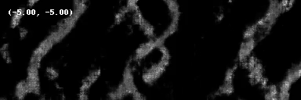

# 🏞️ Variational Autoencoder for Meandering Rivers

This repository contains an implementation of a Variational Autoencoder (VAE) model for generating 128x128 images of meandering rivers.

<div align="center">
  <div style="display: inline-block; vertical-align: top;">
    
  </div>
  <div style="display: inline-block;">
    
    
  </div>
</div>

## 🛠️ Requirements

[](https://pypi.org/project/torch/)
[](https://pypi.org/project/numpy/)
[](https://pypi.org/project/pandas/)
[](https://pypi.org/project/scikit-learn/)
[](https://pypi.org/project/matplotlib/)
[](https://pypi.org/project/Pillow/)

## 🚀 Usage

### 📓 Notebooks

> #### Fully Connected 
- **Training the VAE Fully Connected**: [train_vae_fconnected_notebook](./notebooks/1-train_vae_fconnected_notebook.ipynb)
- **Evaluating the VAE Fully Connected**: [eval_vae_fconnected_notebook](./notebooks/1-eval_vae_fconnected_notebook.ipynb)

> #### Fully Convolutional 
- **Training the VAE Fully Convolutional**: [train_vae_fconv_notebook](./notebooks/2-train_vae_fconv_notebook.ipynb)
- **Evaluating the VAE Fully Convolutional**: [eval_vae_fconv_notebook](./notebooks/2-eval_vae_fconv_notebook.ipynb)

> #### GIFs & Videos
- **Generating GIFs/Videos**: [video_gif_generator.ipynb](./video-gif/video_gif_generator.ipynb)


## 📦 Installing Dependencies

You can install all the necessary dependencies listed in the `requirements.txt` file using one of the following methods:

### 1. **Using pip from the terminal**

If you are in the root directory of the project, where the `requirements.txt` file is located, run:

```bash
$ pip install -r requirements.txt
```

## 🤖 Train 

If you prefer to run the model directly without using the notebooks, you can execute the training script from the terminal:

> Fully Connected

```bash
!python train.py --path "./train_images.h5" --model fconnected  --batch_size 128 --epochs 100

```

> Fully Convolutional

```bash
!python train.py --path "./train_images.h5" --model fconv --batch_size 128 --epochs 100
```

This will start the training process using the `train.py` script, which is configured to load the dataset, prepare the model, and begin training.
